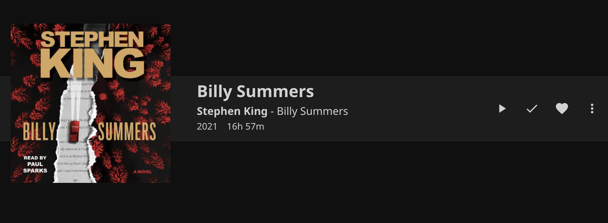
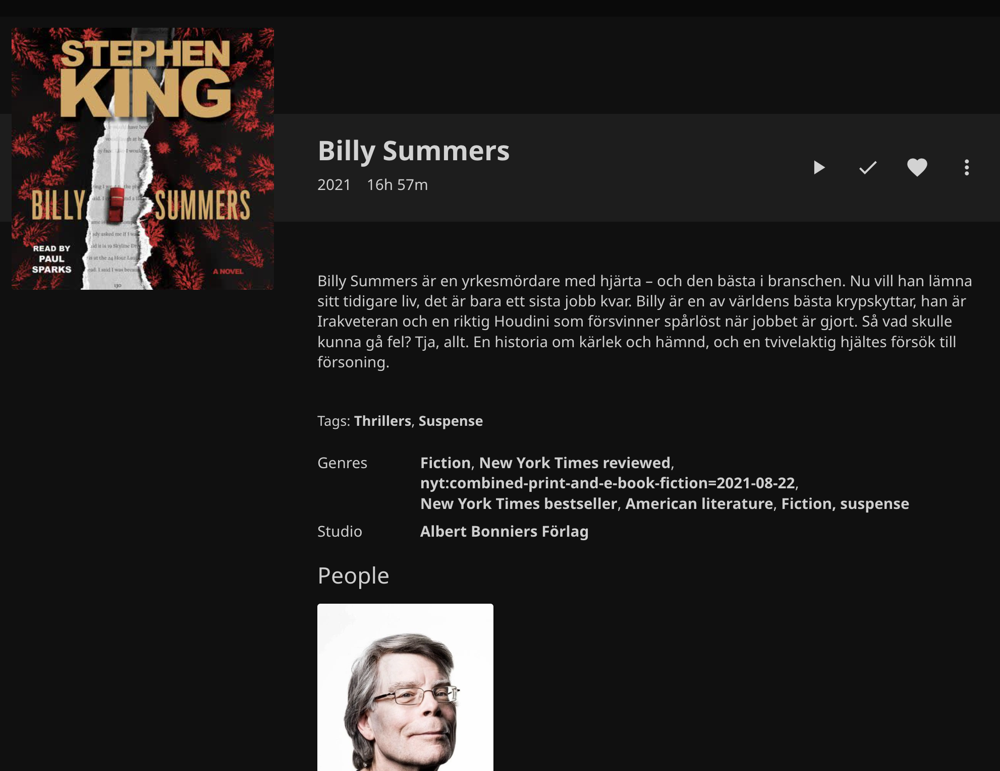

<h1 align="center">Jellyfin Bookshelf Plugin</h1>
<h3 align="center">Part of the <a href="https://jellyfin.org/">Jellyfin Project</a></h3>

<p align="center">


<br/>
<br/>
<a href="https://github.com/jellyfin/jellyfin-plugin-bookshelf/actions?query=workflow%3A%22Test+Build+Plugin%22">

</a>
<a href="https://github.com/jellyfin/jellyfin-plugin-bookshelf">

</a>
<a href="https://github.com/jellyfin/jellyfin-plugin-bookshelf/releases">

</a>
</p>

## About

The Jellyfin Bookshelf plugin enables the collection of eBooks & AudioBooks, with the latter being able to be played through Jellyfin.

### Supported eBook file types

- epub
- mobi
- pdf
- cbz
- cbr

### Supported audio book file types

Please take in mind that this is not a complete list and represents some of the most commonly used formats.

- mp3
- m4a
- m4b
- flac

### Offline Metadata providers

This plugin supports the following offline Metadata providers. These will check the local files for metadata.

- [Open Packaging Format (OPF)](http://idpf.org/epub/20/spec/OPF_2.0.1_draft.htm)
- Calibre OPF
- [ComicInfo](https://github.com/anansi-project/comicinfo)
- [ComicBookInfo](https://code.google.com/archive/p/comicbookinfo/)

The following **limitations** apply:

- .cbr Comics tagged with ComicRacks ComicInfo format are partially supported. Any metadata within the comic book itself will be ignored while external metadata within a ComicInfo.xml file can be read.
- The _[Advanced Comic Book Format](https://launchpad.net/acbf)_ is not supported.
- The _[CoMet](https://www.denvog.com/comet/comet-specification/)_ format is not supported.

### Online Metadata providers

These Metadata providers will check online services for metadata.

- Google Books
- Comic Vine

To use the Comic Vine metadata provider, you will need to set an API key on the plugin's configuration page.

## Enhanced Audiobook Support

This fork includes significant enhancements to audiobook metadata extraction and management:

### 📸 Screenshots

#### Before


#### After


#### Author Info


### 🎧 Improved Audiobook Metadata Extraction

- **Smart Title Detection**: Extracts clean book titles from folder names instead of messy filenames
- **Enhanced Series Detection**: Automatically detects series information from:
  - Audio file tags (album, title fields)
  - Book titles with patterns like "Series Name, Book 1" or "Series Name #1"
  - Folder structure analysis
- **Multi-Source Metadata**: Combines local metadata with online sources for richer information
- **Format Support**: Supports `.m4b`, `.mp3`, `.m4a`, `.aac`, `.ogg`, `.flac`, `.wma` files

### 🌐 OpenLibrary Integration

- **Book Metadata**: Added OpenLibrary as a metadata provider for enhanced book information
- **Author Biographies**: Fetches detailed author biographies and biographical information
- **Dual-Endpoint Strategy**: Uses both OpenLibrary's works and editions APIs for comprehensive metadata
- **Intelligent Fallback**: OpenLibrary serves as fallback when Google Books lacks information

### 📚 Author Biography Support

- **Rich Author Profiles**: Displays author biographies in Jellyfin's person pages
- **Birth/Death Dates**: Shows author biographical dates when available
- **Person Provider**: Implements full person metadata provider for audiobook authors
- **Automatic Lookup**: Author biographies are fetched automatically during metadata refresh

### 🔄 Multi-Provider Strategy

The enhanced system uses an intelligent fallback approach:

1. **Local Extraction**: Extracts metadata from audio file tags and folder structure
2. **Google Books**: Primary online source for descriptions, genres, publication info
3. **OpenLibrary**: Fallback provider for missing metadata and author biographies
4. **Smart Merging**: Combines best information from all sources

### 📖 Series Support

- **Automatic Detection**: Identifies book series from multiple sources
- **Flexible Parsing**: Handles various series naming patterns
- **Index Numbers**: Correctly assigns book numbers within series
- **Display Integration**: TODO

### 📁 Folder Structure Support

The system works best with organized folder structures like:
```
/Audiobooks/
  ├── Author Name/
  │   ├── Book Title/
  │   │   └── book.m4b
  │   └── Series Name/
  │       ├── Book 1 Title/
  │       │   └── book1.m4b
  │       └── Book 2 Title/
  │           └── book2.m4b
```

But also handles flat structures and various naming conventions.

## Build & Installation Process

1. Clone this repository

2. Ensure you have .NET Core SDK setup and installed

3. Build the plugin with following command:

```bash
dotnet publish --configuration Release --output bin
```

4. Place the resulting `Jellyfin.Plugin.Bookshelf.dll` file in a folder called `plugins/` inside your Jellyfin installation / data directory.
